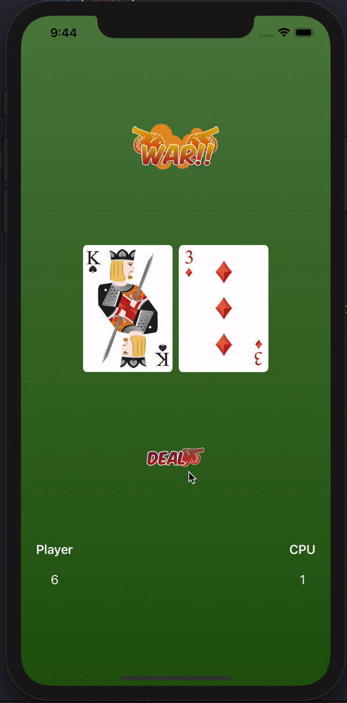
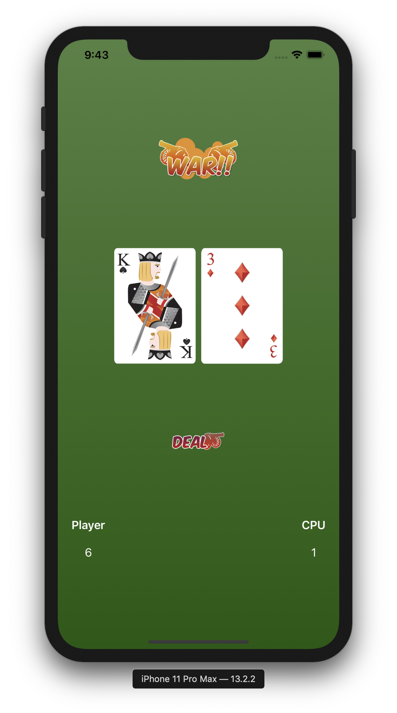

# WarCardGame

## WarCardGame builded with SwiftUI

#### I developed a WarCard Game using SwiftUI that counts which card is greater than the other.

---

### App Stracture:

+ `VStack`
+ `HStack`
+ `ZStack`
+ `@State`

---

### The App:

---

Tutorial Source: [CodeWithChris](https://www.youtube.com/watch?v=lIxq4TCdlRU)
